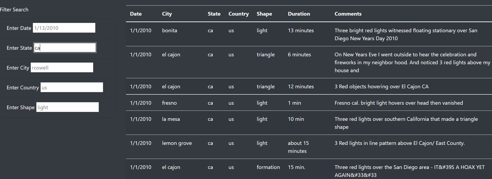

# UFOs
Javascript practice : Filterable table of reported UFO sightings

## Overview
### Purpose of the analysis
The objective of this analysis was to create an interactive webpage showcasing data about reported UFO sightings. The key feature was the interactive filters that allow a user to specify a state, country, date, city, or shape to narrow down the data to those most relevant to the user's interests. This was accomplished using a JavaScript object file containing data bout sightings, a combination of HTML and CSS to style the page, and further JavaScript to allow for the filter fields to be interactive.

## Results
Upon its initial loading, the webpage will default to showing all of the sightings in the data file, sorted by date. 

A user might, for example, wish to see only the sightings from California, which account for a fair portion of the overall data set. By typing "ca" into the State field and pressing enter, the user activates the event listener for changes to the field, which fitlers the data to show only sightings with the state value "ca."

The user might then follow a similar method to further narrow those results to one of the more common shapes in the data set, "light". Once again, entering a value in the search field activates the event listener, which then runs the data through a new filter.

For even more specificity, the date field can be used in m/dd/yyyy format to show only the sightings on a specific day. For example, this image shows the final result of narrowing the data to sightings of lights in California on January 4.

## Summary
### Drawback of the analysis
An important drawback of the current design is that there is no active way to submit more data without modifying the data.js file. In order to incorporate more sightings, especially to expand beyond the two-week window represented by the current data, would require a developer to access an underlying file and input a new object, which would then have to be formatted correctly and include values for each field.

### Recommendations for Further Development
- The text-based fields are currently case-sensitive, which looks like a potential source of confusion. Users enter two-letter state codes, which are usually written in capital letters, but the corresponding data is lowercase. It may be easier to use the filters if they would accept input in any combination of cases. 

- The "Comments" field contains the most descriptive data, but is currently unable to be filtered or searched. If the use of the webpage is to find connections between sightings, it may be worth allowing users to search for words or phrases that appear in the comments for multiple entries.